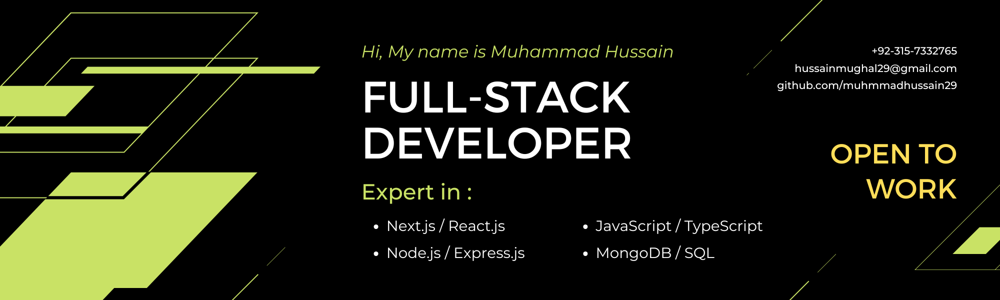

<!-- Hero Banner -->

  

<h1 align="center">Hi 👋, I'm Muhammad Hussain</h1>
<h3 align="center">Full-Stack Developer | MERN Stack | SaaS Builder</h3>

  

---

## 🚀 About Me
- 💻 Full-Stack Developer specializing in **MERN & Next.js**
- ⚡ Building **end-to-end SaaS applications & dashboards**
- 🔐 Experience with **authentication, APIs & scalable systems**
- 🌱 Currently improving **backend & system design skills**
- 📫 Reach me: **hussainmughal29@gmail.com**

---

## 🛠 Tech Stack

## 🤝 Connect With Me

---

## 📊 GitHub Stats

  

  

  

---

⭐️ From [Muhammad Hussain](https://github.com/muhammadhussain29)
