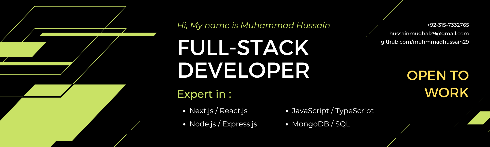

<!-- Hero Banner -->

  

<h1 align="center">Hi 👋, I'm Muhammad Hussain</h1>

<h3 align="center">
  Software Engineer | Full-Stack Developer | MERN Stack | Next.js
</h3>

  

---

## 👨‍💻 About Me

- 💻 Software Engineer with hands-on experience in **MERN Stack & Next.js**
- 🚀 Building **production-ready web applications, SaaS platforms & dashboards**
- ⚛️ Experienced with **React.js, Next.js, TypeScript & Tailwind CSS**
- 🔐 Building applications with **JWT authentication, RBAC & protected routes**
- 🔌 Experienced in **REST APIs, API integration & full-stack development**
- 🗄️ Working with **MongoDB, PostgreSQL & SQL**
- 🌱 Currently expanding my skills in **Python, Django & AI**
- 🤝 Open to collaborating on interesting **web and SaaS projects**
- 📫 Reach me at **hussainmughal29@gmail.com**

---

## 🛠️ Tech Stack

### Frontend

  

### Backend & Database

  

### Tools & Technologies

  

---

## 🚀 Featured Projects

### 🎮 GameSwap Marketplace
Full-stack game marketplace built for a client.

- Authentication & role-based dashboards
- Checkout & shipment management
- Payout workflows
- Barcode scanning
- Admin dashboard
- JWT authentication & protected routes
- Redux Toolkit state management
- REST API integration

**Tech:** Next.js, React.js, TypeScript, Tailwind CSS, Redux Toolkit, Node.js, Express.js, PostgreSQL

---

### ⏱️ Time Tracking & Invoicing SaaS

A SaaS platform for time tracking, invoicing, project management and productivity monitoring.

- Time tracking & manual time entries
- Invoice generation
- Project management
- Subscription-based access control
- Stripe Checkout & webhooks
- JWT authentication
- Role-based access control
- Admin dashboards & reporting

**Tech:** Next.js, React.js, TypeScript, Node.js, Express.js, MongoDB, Stripe

---

### 📝 Notes Management App

Responsive notes management application with complete CRUD functionality.

**Tech:** React.js, JavaScript, Tailwind CSS, Local Storage

---

### 🎨 Animated Agency Website

Modern responsive landing page with advanced animations and interactive UI.

**Tech:** HTML5, Tailwind CSS, JavaScript, GSAP, ScrollTrigger

---

## 💼 Experience

**Freelance Full-Stack Developer**  
*May 2026 – Present*

Working on client projects using React.js, Next.js, TypeScript, Tailwind CSS, Node.js, Express.js and PostgreSQL.

**MERN Stack Developer — The Byte Pulse**  
*Dec 2025 – May 2026*

Developed full-stack applications, SaaS platforms, dashboards, REST APIs, authentication systems and responsive interfaces.

**Frontend Developer — Digital Elliptical**  
*Aug 2025 – Oct 2025*

Developed responsive React.js interfaces, integrated REST APIs and worked on debugging, optimization and client projects.

---

## 📊 GitHub Stats

  

  

  

---

## 🤝 Connect With Me

  
  
  

---

  ⭐️ From <a href="https://github.com/muhammadhussain29">Muhammad Hussain</a>

