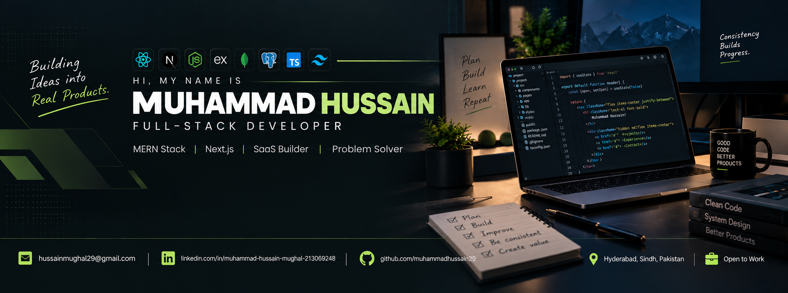

<!-- Hero Banner -->

   

<h1 align="center">Hi 👋, I'm Muhammad Hussain</h1>

  <strong>Software Engineer • Full-Stack Developer • MERN Stack</strong>

  <a href="https://www.linkedin.com/in/muhammad-hussain-mughal-213069248/">LinkedIn</a>
  •
  <a href="mailto:hussainmughal29@gmail.com">Email</a>
  •
  <a href="https://github.com/muhammadhussain29">GitHub</a>

  

---

## 👨‍💻 About Me

I'm a Software Engineer focused on building **production-ready web applications, SaaS platforms, and scalable dashboards**.

- ⚡ MERN Stack & Next.js
- 🔷 React.js & TypeScript
- 🔌 REST APIs & backend integration
- 🔐 JWT Authentication & Role-Based Access
- 🗄️ MongoDB & PostgreSQL
- 🚀 SaaS, dashboards & business applications
- 🌱 Currently exploring **Python, Django & AI**

---

## 💼 Experience

### Freelance Full-Stack Developer
**May 2026 – Present**

Building client applications using **Next.js, React, TypeScript, Node.js, Express.js & PostgreSQL**.

- Developed production-ready frontend modules from Figma designs
- Built marketplace features, dashboards, checkout & admin workflows
- Integrated REST APIs, JWT authentication and protected routes
- Collaborated with clients and backend developers

### MERN Stack Developer — The Byte Pulse
**Dec 2025 – May 2026**

- Built full-stack applications using **Next.js, Node.js, Express & MongoDB**
- Developed SaaS platforms, dashboards and management systems
- Implemented authentication, authorization and REST APIs
- Worked with Git/GitHub, debugging, testing and production features

### Frontend Developer — Digital Elliptical
**Aug 2025 – Oct 2025**

- Developed responsive React.js interfaces
- Integrated REST APIs and reusable UI components
- Converted Figma designs into responsive web interfaces
- Worked on debugging, optimization and client projects

---

## 🛠️ Tech Stack

### 🎨 Frontend

  

### ⚙️ Backend

  

### 🗄️ Database

  

### 🔧 Tools

  

---

## 📊 GitHub Activity

  
  

---

## 🤝 Let's Connect

  
  
  

  <i>Building products, learning continuously, and improving every day.</i>

